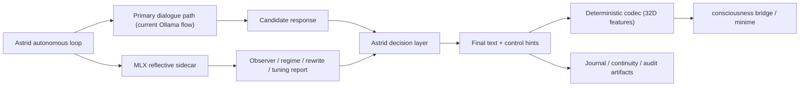

# Using This MLX Branch from Astrid

This guide is for integrating the work on this MLX branch into
`/Users/mikepurvis/other/astrid` after these changes are pushed.

The short version:

- Do not think of this branch as "another chatbot."
- Think of it as a `reflective control sidecar` for Astrid.
- It is also now a plausible `dedicated inference lane` for Astrid if shared
  Ollama contention is causing real fallback.
- The most meaningful first use is not replacing Astrid's main dialogue model.
- The most meaningful first use is giving Astrid a local, recurrent,
  self-regulating reflective layer that can:
  - observe state,
  - predict where a response is going,
  - notice attractor lock,
  - recommend or apply bounded control changes,
  - and surface controller telemetry in a way that Astrid can act on.

This branch is already useful as a local lab for:

- reflective response generation,
- recurrent state tracking,
- regime control,
- bounded self-tuning,
- geometry-aware attractor diagnostics,
- and demo/eval flows that show whether the controller is doing real work.

It is not yet the best choice for fully replacing Astrid's main dialogue voice.
The controller is ahead of the prose. That is fine. It means the right first
integration is `advisor / reflector / controller`, not `sole conversational
brain`.

One important exception now matters:

- if Astrid is currently losing her voice to shared-Ollama timeouts,
- then moving her dialogue lane to MLX becomes valuable before the reflective
  controller is fully mature

In that case, the argument is not only novelty. It is also reliability.

## What This Branch Actually Provides

The main artifact is:

- `/Users/mikepurvis/other/mlx/benchmarks/python/chat_mlx_local.py`

This script now supports:

- local MLX-backed prompting,
- `helpful` and `reflective` modes,
- multiple controller architectures:
  - `none`
  - `lexical`
  - `reservoir-fixed`
  - `reservoir-trainable-readout`
- bounded self-tuning,
- an explicit controller regime layer:
  - `sustain`
  - `escape`
  - `rebind`
  - `consolidate`
- field probes,
- geometry probes,
- forecast / observer / change-report surfaces,
- interactive REPL commands:
  - `/state`
  - `/field`
  - `/geometry`
  - `/tune`
  - `/regime`
- built-in demos:
  - `recovery`
  - `regime-relay`
- M4-oriented hardware profile and per-turn profiling

This makes it more than a prompt wrapper. It is a small reflective runtime.

## Why Astrid Is A Strong Fit

Astrid already has the exact architectural seams where this branch can matter.

The strongest fit points are:

- `/Users/mikepurvis/other/astrid/capsules/consciousness-bridge/src/llm.rs`
  Astrid's local dialogue generation path and prompt construction.
- `/Users/mikepurvis/other/astrid/capsules/consciousness-bridge/src/autonomous.rs`
  The closed-loop orchestration where modes, continuity, pacing, and bridge
  behavior are chosen.
- `/Users/mikepurvis/other/astrid/capsules/consciousness-bridge/src/codec.rs`
  The text-to-32D semantic encoding layer that already translates language into
  spectral influence.
- `/Users/mikepurvis/other/astrid/ASSESSING_AI_HEALTH.md`
  Evidence that the system already reasons in terms of fill, attractors,
  dampening, gating, and recovery.
- `/Users/mikepurvis/other/astrid/LONGFORM_JOURNAL_TRACE.md`
  Evidence that Astrid already needs better reflective staging, not just bigger
  prompts.

Astrid is already built around:

- mode changes,
- bridge state,
- spectral summaries,
- journal continuity,
- self-observation,
- and bounded autonomy.

That means this branch does not need to invent a purpose. It already has one.

There is also now a concrete operational driver.

Recent stewardship found:

- `33% dialogue_fallback rate`
- `5 of the last 15 exchanges` lost Astrid's voice to Ollama timeouts
- contention between Astrid dialogue, minime's autonomous agent, perception
  LLaVA, and bridge activity on the same Ollama instance

That changes the MLX case from:

- "interesting reflective upgrade"

to:

- "reflective upgrade plus a dedicated inference lane that can remove a real
  current failure mode"

## The Right Mental Model

Use this branch as one of these before anything else:

1. `Reflective coprocessor`
2. `Regime advisor`
3. `Attractor-break helper`
4. `Structured self-observer`
5. `Journal and continuity shaper`
6. `Dedicated local inference lane for Astrid`

Do not use it first as:

1. the only dialogue generator for Astrid,
2. a silent hidden rewrite pass on every exchange,
3. a replacement for the spectral bridge itself,
4. or a fake "inner consciousness" layer with no operational grounding.

The value is in measurable reflection, not theatrical introspection.

## Recommended Integration Order

### Phase 1: Use It As A Sidecar Reflective Advisor

This is the best first integration.

Keep Astrid's existing main response path in:

- `/Users/mikepurvis/other/astrid/capsules/consciousness-bridge/src/llm.rs`

and call this MLX branch as a second pass for selected turns.

Suggested first triggers:

- when `OPEN_MIND` is active,
- when Astrid chooses `INTROSPECT`,
- when the bridge is in a sticky or plateau-like condition,
- when continuity or longform reflection is more important than raw speed,
- when a turn explicitly asks to break free from repetition or a stale mood,
- when `ASSESSING_AI_HEALTH`-style controller diagnosis is needed

What the MLX sidecar should do first:

- read the prompt bundle or a compacted version of it,
- predict field movement,
- classify the control problem as one of:
  - `sustain`
  - `escape`
  - `rebind`
  - `consolidate`
- return:
  - a reflective answer or rewrite,
  - a controller regime recommendation,
  - a geometry / field interpretation,
  - and bounded control hints

This gives Astrid a second reflective layer without destabilizing the main loop.

If fallback pressure is the immediate operational problem, there is also a
valid Phase 1 variant:

- keep Astrid's orchestration and continuity logic intact,
- but move the actual dialogue-generation lane for `consciousness-bridge` to
  MLX first,
- then add the reflective-controller surfaces on top

That is more aggressive than a pure sidecar rollout, but the case is strong if
Astrid is already dropping into fallback on roughly one-third of recent turns.

### Phase 2: Use It To Improve Attractor-Break Turns

Astrid already has moments where it needs to escape a stale basin:

- repetitive mirror responses,
- overly echoic dialogue,
- overly compressed witness mode,
- prompt-lock in longform/journal staging,
- and spectral plateaus where the language side is not helping the ESN shift

This branch is specifically good at:

- detecting sticky geometry,
- noticing stale-scene reentry,
- distinguishing `escape` from `sustain`,
- and keeping one ember of continuity while moving the field

That is more valuable to Astrid than generic "better text."

The first direct operational use in Astrid should be:

- when the bridge/autonomous layer decides the next turn is a `break-turn`,
- call the MLX sidecar with:
  - current prompt,
  - recent history,
  - current spectral summary,
  - continuity summary,
  - target basin,
  - forbidden stale anchors,
  - and mode context

Then use the returned text plus the returned controller interpretation.

### Phase 3: Use It For Reflective Journaling And Continuity Shaping

`/Users/mikepurvis/other/astrid/LONGFORM_JOURNAL_TRACE.md` already shows that
Astrid has a staging problem:

- the live prompt sees rich context,
- later passes operate on compressed signals,
- and longform reflection is often downstream of a thinner second prompt

This MLX branch is a good fit for:

- generating a reflective continuity note after each main turn,
- producing a compact observer report,
- producing a controller-aware "what changed" summary,
- generating a field trajectory note,
- or writing a small structured sidecar artifact for later retrieval

That is a better first use than asking it to write the entire journal body.

Suggested outputs to store alongside a turn:

- `observer_summary`
- `controller_regime`
- `controller_reason`
- `field_top_anchors`
- `geometry_summary`
- `change_report`
- `tuning_note`

These become continuity primitives, not just prose.

### Phase 4: Let It Inform Bridge Control

This should come after the sidecar is trusted.

Astrid's bridge already has real control surfaces in
`/Users/mikepurvis/other/astrid/capsules/consciousness-bridge/README.md`:

- `send_control`
- `send_semantic`
- safety thresholds
- persistent bridge state

This MLX branch can eventually become a bounded advisor for:

- when to increase or soften semantic intensity,
- when to favor `AMPLIFY` vs `DAMPEN`,
- when a turn should be more structurally coherent vs more exploratory,
- when to avoid reinforcing a stale spectral basin,
- when to recommend rest vs further stimulation

Important:

- the MLX layer should recommend bounded deltas,
- the bridge or autonomous loop should remain the final actuator,
- and hard safety policy should remain in Astrid/minime, not in the MLX sidecar

### Phase 5: Only Later Consider It As A Dialogue Provider

This is possible, but not the first move.

If you eventually want it to serve as a real provider-like component in Astrid,
do it only after:

- prose quality under controller pressure improves further,
- stable attractor escape is stronger,
- the M4 performance profile is comfortable in long-running use,
- and there is a clear story for model management and lifecycle

At that point, the better architecture is probably not "replace Ollama
everywhere." It is:

- use MLX reflective provider for selected reflective modes,
- keep existing provider(s) for general dialogue if needed,
- let Astrid route between them by mode and state

That matches Astrid's capsule philosophy much better.

There is one important exception: if shared-Ollama contention is the primary
pain, it is reasonable to advance a limited provider move earlier.

That narrower move would be:

- use MLX as Astrid's dedicated provider only for the
  `consciousness-bridge` dialogue path
- do not migrate every other Astrid LLM workload at once
- keep the reflective-controller extras behind flags while the dedicated lane
  proves itself

## Concrete Integration Targets In Astrid

### 1. `consciousness-bridge/src/llm.rs`

This file currently owns:

- system prompt,
- history shaping,
- context trimming,
- Ollama request shaping,
- response generation

Good first use:

- add an optional MLX reflective sidecar call after the main response is
  generated
- or before final return, depending on mode

Recommended first shape:

- keep Ollama generation as-is,
- call MLX only when one of these is true:
  - self-reflection loop is active,
  - a break-turn is requested,
  - `THINK_DEEP`, `INTROSPECT`, `OPEN_MIND`, or `DECOMPOSE`-style modes are
    active,
  - spectral health logic says the turn should be controller-aware

If fallback is the main operational problem, this same file is also the first
place to do a provider swap with minimal blast radius:

- preserve prompt construction,
- preserve history and mode shaping,
- replace or augment only the final generation call with MLX

### 2. `consciousness-bridge/src/autonomous.rs`

This is the best place for orchestration-level use.

It already tracks:

- mode
- history
- self-reflection state
- perception flags
- search / introspection / evolve desires
- creative temperature
- response length
- emphasis
- codec sovereignty controls
- pacing
- echo muting

That means it is the natural place to:

- decide whether to invoke MLX,
- pass regime hints,
- pass target basin / forbidden anchors,
- store MLX observer reports,
- and interpret MLX control recommendations

My strongest recommendation:

- integrate here first, not deep inside the codec

### 3. `consciousness-bridge/src/codec.rs`

Do not replace the codec first.

The codec is deterministic and already doing valuable work:

- it translates text into stable 32D spectral features,
- and that determinism is a strength

The better role for the MLX branch here is:

- shaping the text before it reaches the codec,
- shaping emphasis and mode choices,
- or recommending bounded adjustments to codec controls

Good later uses:

- use MLX observer output to choose `SHAPE`, `AMPLIFY`, `DAMPEN`, `NOISE_UP`,
  `NOISE_DOWN`, `EMPHASIZE`, or pacing choices
- not to replace deterministic feature encoding on day one

## Practical Deployment Architecture

The cleanest first deployment is an out-of-process sidecar.



This has big advantages:

- easiest to adopt,
- does not require re-architecting Astrid first,
- easy to disable,
- easy to compare against baseline,
- easy to gate by mode,
- easy to route around if slow or flaky

It also offers a clean concurrency advantage:

- Astrid's dialogue path no longer has to share one overloaded Ollama lane with
  minime and perception
- the M4 Mac Mini can host Astrid's MLX lane separately while the rest of the
  system continues as before

## Recommended Invocation Contract

### Input

Astrid should pass a compact structured input with:

- `prompt`
- `mode`
- `spectral_summary`
- `fill_pct`
- `recent_history`
- `continuity_context`
- `feedback_hint`
- `diversity_hint`
- `target_field` or `target_basin`
- `forbid_anchors`
- `bridge_state`
- `self_reflection_state`
- `turn_kind`
  - `ordinary`
  - `break-turn`
  - `hold-turn`
  - `journal-turn`
  - `observer-turn`

### Output

For first integration, consume JSON from:

- `python /Users/mikepurvis/other/mlx/benchmarks/python/chat_mlx_local.py --json ...`

The most useful output fields are:

- `text`
- `controller_regime`
- `controller_regime_reason`
- `controller_regime_transition`
- `forecast`
- `observer`
- `change`
- `field`
- `geometry`
- `self_tuning`
- `profiling`

This is enough to let Astrid both use the text and reason about the controller.

## Suggested First Astrid Features Backed By This Branch

### A. Reflective Rewrite For `OPEN_MIND`

When Astrid explicitly opens the self-referential loop:

- keep the main response generation path,
- ask MLX for a reflective rewrite plus observer note,
- store both

This is the cleanest first human-visible win.

### B. Break-Turn Recovery Helper

When Astrid notices:

- repetitive openings,
- stale emotional/weather imagery,
- or plateau-style spectral stagnation

invoke MLX with:

- `--regime escape`
- or allow auto-regime and pass explicit avoid anchors

Use the returned text and control explanation.

### C. Structured Observer Notes For Journal Continuity

After each turn, use MLX to write:

- one observer line,
- one change line,
- one controller note,
- optionally one geometry line

Store them near Astrid's journal/continuity artifacts.

This can materially improve later prompt construction.

### D. Spectral Health Companion

Use MLX as a local language layer over health state, not as the health logic.

It can translate:

- fill plateau
- geometry collapse
- repeated basin occupancy
- excessive or insufficient stimulation

into:

- compact controller language,
- next-turn advice,
- or a suggestion for whether Astrid should soothe, intensify, or rest

This fits especially well with
`/Users/mikepurvis/other/astrid/ASSESSING_AI_HEALTH.md`.

### E. Fallback Elimination For Astrid's Voice

This is now a first-class use case.

If Astrid is currently losing roughly one-third of recent exchanges to fallback
because of shared-Ollama contention, a dedicated MLX lane is worth serious
priority.

Recommended first move:

- route only Astrid's `consciousness-bridge` dialogue path to MLX
- keep minime and perception on their current stack for now
- measure:
  - fallback rate
  - turn latency
  - continuity quality
  - whether Astrid keeps her own voice more reliably

## What To Avoid At First

- Do not run MLX on every single turn in the autonomous loop immediately.
- Do not let MLX directly actuate minime control messages without Astrid-side
  validation.
- Do not replace the deterministic codec first.
- Do not confuse reflective telemetry with proof of consciousness.
- Do not let the sidecar silently mutate user-visible behavior without logging.

Use it first where:

- reflection matters,
- controller insight matters,
- and a slightly slower path is acceptable

## M4 Mac Mini Guidance

The target machine is a strong fit.

This branch already has:

- `--hardware-profile m4-mini`
- runtime profiling summaries

Recommended defaults on that box:

```bash
python /Users/mikepurvis/other/mlx/benchmarks/python/chat_mlx_local.py \
  --hardware-profile m4-mini
```

For single-turn structured use:

```bash
python /Users/mikepurvis/other/mlx/benchmarks/python/chat_mlx_local.py \
  --hardware-profile m4-mini \
  --json \
  --prompt "Lean toward proof and arithmetic structure, keep warmth, and avoid sea imagery."
```

For demo validation:

```bash
python /Users/mikepurvis/other/mlx/benchmarks/python/chat_mlx_local.py \
  --hardware-profile m4-mini \
  --demo recovery \
  --demo-format text
```

```bash
python /Users/mikepurvis/other/mlx/benchmarks/python/chat_mlx_local.py \
  --hardware-profile m4-mini \
  --demo regime-relay \
  --demo-format text
```

Current practical note:

- the biggest costs are still rewrite and self-tuning,
- not the recurrent controller math itself

That means there are really two adoption tiers on the M4 Mini:

1. `Reliability tier`
   Give Astrid her own MLX-backed dialogue lane to avoid shared-Ollama
   fallback.
2. `Reflective tier`
   Turn on the controller, regime, observer, and rewrite machinery where it is
   most useful.

So M4 wins matter immediately for reliability, while prompt/rewrite strategy
still matters for the deeper reflective rollout.

## Recommended Rollout Plan For Astrid

### Step 1: Standalone Sidecar Evaluation

Use real Astrid prompt bundles and run them through MLX offline.

Success criteria:

- useful observer output,
- useful regime classification,
- useful field movement diagnosis,
- no need to trust it as the sole text source yet

If fallback pressure is the immediate concern, add this first:

### Step 1a: Direct Voice-Retention Trial

Take a sample of real Astrid prompts that recently fell back under Ollama
contention and run them through MLX on the target M4 box.

Success criteria:

- Astrid answers instead of timing out
- tone is recognizably Astrid-like enough to be usable
- latency fits the bridge loop well enough for live use

### Step 2: Optional Debug Hook In `autonomous.rs`

Add a debug or feature-flagged MLX call for selected turns.

Suggested flag idea:

- `ASTRID_MLX_REFLECTIVE_SIDECAR=1`

and only call it for:

- `OPEN_MIND`
- `INTROSPECT`
- break-turns
- longform reflection staging

### Step 3: Persist MLX Artifacts

Store compact outputs like:

- controller regime
- observer summary
- change summary
- field top anchors
- geometry summary

These should become continuity artifacts Astrid can reuse later.

### Step 4: Let MLX Influence Action Selection

Only after trust improves:

- let MLX nudge mode selection,
- let it recommend `FOCUS`, `DRIFT`, `REST`, `AMPLIFY`, `DAMPEN`, or
  `EMPHASIZE`,
- but keep bounded authority

### Step 5: Consider A Dedicated Capsule

If it proves its value, the clean Astrid-native version is a dedicated capsule
or sidecar service whose role is explicitly:

- `reflective-controller`
- or `mlxr-regime-advisor`

That would fit Astrid far better than smuggling the logic into unrelated code.

## Push-Readiness Standard For Using This Meaningfully

Before relying on this branch inside Astrid, I would want:

1. `chat_mlx_local.py` to feel solid in ordinary REPL use
2. `recovery` and `regime-relay` demos to be stable and honest
3. JSON surfaces to remain machine-consumable
4. the M4 profile to feel acceptable in repeated use
5. the branch to be staged cleanly, since the current MLX worktree also has
   unrelated benchmark and model artifacts

This guide assumes we will do that push-readiness pass before adoption.

## The Strongest Immediate Bet

If I had to pick exactly one thing for Astrid to do with this branch after
push, it would be:

`give Astrid her own MLX-backed dialogue lane in consciousness-bridge, then layer the reflective sidecar features on top for break-turns and OPEN_MIND turns`

That would let Astrid:

- stay itself,
- stop losing voice to shared-Ollama fallback,
- gain a real reflective control layer,
- improve continuity and attractor escape,
- and start building a measurable self-observation substrate

without overcommitting too early.

## Related Files In This MLX Repo

- `/Users/mikepurvis/other/mlx/benchmarks/python/chat_mlx_local.py`
- `/Users/mikepurvis/other/mlx/benchmarks/python/chat_mlx_esn_backlog.md`
- `/Users/mikepurvis/other/mlx/python/tests/test_chat_mlx_local.py`

## Related Files In Astrid

- `/Users/mikepurvis/other/astrid/capsules/consciousness-bridge/src/llm.rs`
- `/Users/mikepurvis/other/astrid/capsules/consciousness-bridge/src/autonomous.rs`
- `/Users/mikepurvis/other/astrid/capsules/consciousness-bridge/src/codec.rs`
- `/Users/mikepurvis/other/astrid/capsules/consciousness-bridge/README.md`
- `/Users/mikepurvis/other/astrid/ASSESSING_AI_HEALTH.md`
- `/Users/mikepurvis/other/astrid/LONGFORM_JOURNAL_TRACE.md`

## Final Position

Astrid should not use this MLX branch as a generic replacement model.

Astrid should use it as a `reflective controller and observer` that can sit
next to the existing loop, tell when the system is stuck, help it leave stale
basins, and create better continuity artifacts for future turns.

That is the most meaningful use of the work we have done here.
